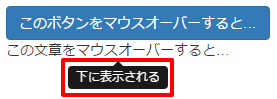
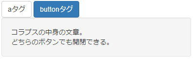
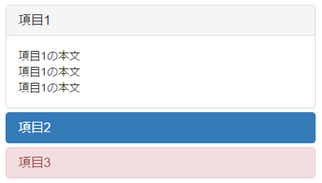
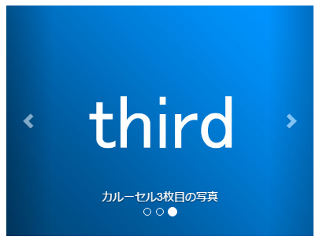

## コンポーネント
### ナビゲーション・バー
[英語](http://getbootstrap.com/components/#navbar) |
[日本語](http://bootstrap3.cyberlab.info/components/navbar.html) |
[デモ](https://sutara79.github.io/demo-bootstrap/demo/navbar.html)

(PCでの表示)  

(モバイルでの表示)  

- - -
## JavaScript
### ツールチップ
[英語](http://getbootstrap.com/javascript/#tooltips) |
[日本語](http://bootstrap3.cyberlab.info/javascript/tooltips.html) |
[デモ](https://sutara79.github.io/demo-bootstrap/demo/tooltip.html)

- - -
### コラプス
[英語](http://getbootstrap.com/javascript/#collapse) |
[日本語](http://bootstrap3.cyberlab.info/javascript/collapse.html) |
[デモ](https://sutara79.github.io/demo-bootstrap/demo/collapse.html)

- - -
### アコーディオン
[英語](http://getbootstrap.com/javascript/#collapse-example-accordion) |
[日本語](http://bootstrap3.cyberlab.info/javascript/collapse-accordion.html) |
[デモ](https://sutara79.github.io/demo-bootstrap/demo/accordion.html)

- - -
### カルーセル
[英語](http://getbootstrap.com/javascript/#carousel) |
[日本語](http://bootstrap3.cyberlab.info/javascript/carousel.html) |
[デモ](https://sutara79.github.io/demo-bootstrap/demo/carousel.html)

